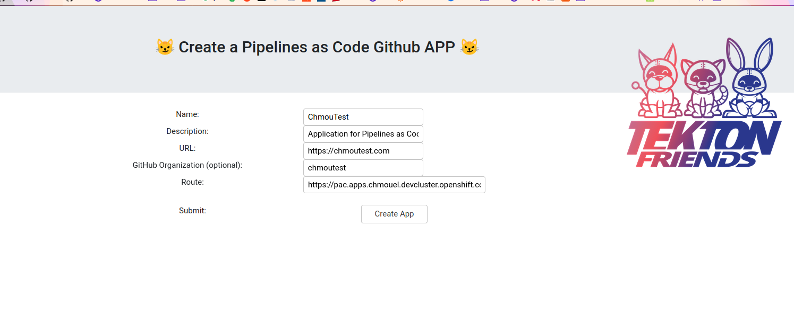

# Pipelines as Code: Github app creator helper

This simple web service will help you create automatically a Github app with
pipeline as code using [Github manifest](https://docs.github.com/en/developers/apps/creating-a-github-app-from-a-manifest)

## Screenshot

## Usage

Fill up the App Name, App description, App URL.

Optionally add an Organization if you are creating this app in a Org or leave it
blank if it's in your own users.

Fill up the target route where the eventlistenner is exposed, by default it will
be automatically detected with the first route exposed to TLS available.

When submitted and after you being redirected, it will create a new secret called `github-app-secret` with :

`application_id` The id of the app that got just created
`webhook_secret` The webhook secret for validation
`private.key` The private key of the application
